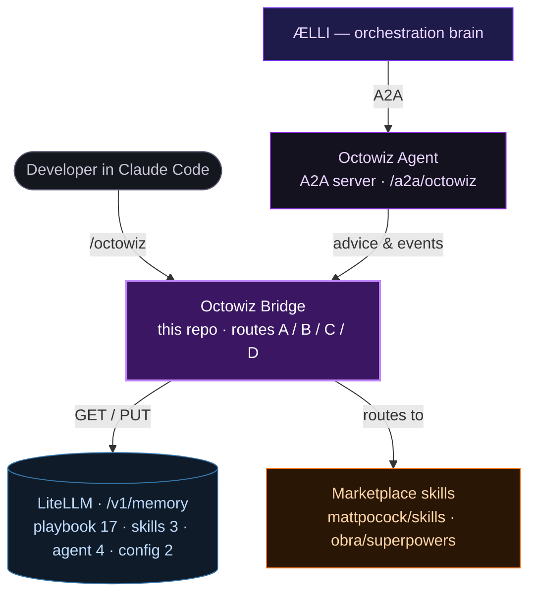
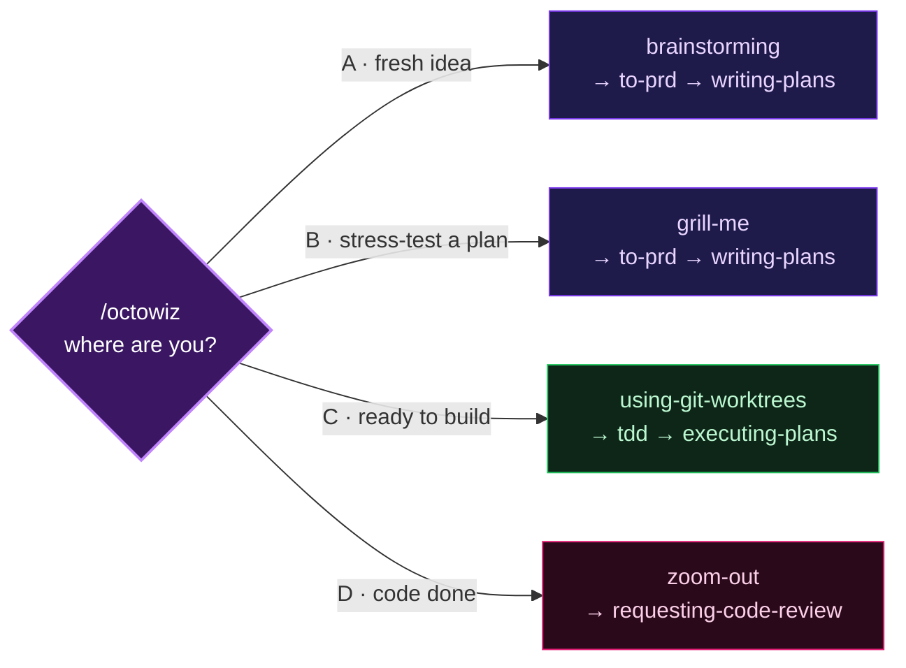

<div align="center">


# octowiz

**The Claude Code bridge for the ÆLLI engineering agent.**

[](LICENSE)
&nbsp;
&nbsp;
&nbsp;
&nbsp;

[**Live overview ↗**](https://raelli.github.io/octowiz/) &nbsp;·&nbsp; [ÆLLI — orchestration brain](https://github.com/raelli/aelli) &nbsp;·&nbsp; [Install](#install)

</div>

---

octowiz is ÆLLI's coding tentacle — the Claude Code plugin component of the ÆLLI engineering agent. It stores AI-coding operating doctrine in [LiteLLM Proxy](https://docs.litellm.ai/) `/v1/memory` and exposes a `/octowiz` entry point that reads those memories at runtime and routes to the right combination of [obra/superpowers](https://github.com/obra/superpowers) and [mattpocock/skills](https://github.com/mattpocock/skills) for the current phase.

> **Small context. No prompt soup.**

## Why this exists

Most AI coding tools hand an agent either a giant system prompt or no method at all. octowiz takes a third path: doctrine lives in a memory store, agents fetch only what is relevant to their current phase, and the coordinator routes to purpose-built skill libraries rather than trying to be everything itself.

The result is a context window that stays small and focused. A planner gets planning doctrine. An implementer gets TDD loops and deep-module principles. A reviewer gets fresh-context review discipline. None of them carry the others' doctrine as noise.

> **Three layers.** The coordinator reads the project and fetches the relevant doctrine slice; LiteLLM holds the doctrine; installed skills do the work — referenced, never copied.

## Architecture

Doctrine and skills are fetched at runtime, never baked in.



## The /octowiz flow

On invoke, octowiz reads your project state and asks one question — where are you in the workflow? Each answer prepends a different doctrine slice and opens a different skill.



| Option | Starting point | Role slice pulled |
|---|---|---|
| **A** | Fresh idea | `planner` — overview, alignment, PRD, tracer-bullets |
| **B** | Plan to stress-test | `planner` — alignment interview |
| **C** | Ready to implement | `implementer` — context, TDD loops, ralph-loop |
| **D** | Code done, needs review | `reviewer` — fresh-context review, push-pull standards |

## Memory namespaces

26 entries across four prefixes. The importer is idempotent — safe to rerun.

| Prefix | Count | What it contains |
|---|:--:|---|
| `playbook:*` | **17** | Workflow doctrine — plan, slice, implement, review, ship. Context management, alignment interviews, PRD structure, tracer-bullet slicing, TDD, fresh-context review, deep modules. |
| `skills:*` | **3** | Routing summaries for the two upstream skill libraries and the marketplace hub. |
| `agent:{role}:*` | **4** | Role-specific slices for `planner`, `implementer`, `reviewer`, `qa`. Each agent pulls only its own. |
| `config:*` | **2** | Import guidance and the retrieval contract the coordinator reads on startup. |

<details>
<summary><b>Full memory inventory (26 entries)</b></summary>

**Workflow doctrine** — `overview`, `context-smart-zone`, `grill-me-alignment`, `prd-destination-document`, `kanban-tracer-bullets`, `hitl-vs-afk`, `ralph-loop`, `tdd-feedback-loops`, `fresh-context-review`, `manual-qa-taste`, `deep-modules`, `module-interface-first`, `push-pull-standards`, `frontend-prototypes`, `doc-rot`, `parallel-agents`

**External skill routing** — `skill-sources`, `skills:matt-pocock:ai-engineering`, `skills:obra-superpowers:agent-methodology`

**Agent roles** — `planner`, `implementer`, `reviewer`, `qa`

</details>

## Install

Point at your LiteLLM proxy, dry-run the import, then commit it.

```bash
pip install -e .
export LITELLM_BASE_URL="https://your-proxy.example.com"
export LITELLM_ADMIN_API_KEY="sk-..."

# dry-run first
python import_litellm_memories.py memories.json --dry-run

# then commit — upserts 26/26
python import_litellm_memories.py memories.json
```

Install the three required Claude Code plugins. In Claude Code, run `/plugins` and add:

| Plugin | Provides |
|---|---|
| `octowiz` | The `/octowiz` coordinator (this repo) |
| `mattpocock-skills` | Alignment, PRD, TDD, architecture skills |
| `superpowers` | Brainstorming, plans, worktrees, review skills |

> All three are required. `/octowiz` routes to skills from the other two — if either is missing the coordinator fails mid-flow.

## A2A capabilities

When ÆLLI dispatches a task to octowiz via `/a2a/octowiz`, the daemon routes it to the matching handler. Every capability is pull-based — the daemon polls the task queue and executes locally, inside the developer's Claude Code session.

| Capability | Description |
|---|---|
| `octowiz.plan` | Generate an implementation plan for a task description. |
| `octowiz.review` | Review a diff or file set, return structured findings. |
| `octowiz.observe` | Annotate an in-progress session without interrupting it. |
| `octowiz.handoff` | Package session context for the next agent or session. |
| `octowiz.context` | Build a context package — files, git state, memory. |
| `octowiz.dispatch` | Dispatch a background Claude Code session autonomously. |
| `octowiz.run_sandboxed` | Execute inside an isolated Sandcastle container. |
| `octowiz.manage_agents` | List, start, stop, and inspect active agents. |
| `marketplace_info` | Query the IntegraHub Marketplace for skills, plugins, and agents. |

## Attribution

Workflow doctrine is distilled from Matt Pocock's ["Essential Skills for AI Coding from Planning to Production"](https://www.youtube.com/watch?v=-QFHIoCo-Ko) workshop at AI Engineer. octowiz routes to [mattpocock/skills](https://github.com/mattpocock/skills) and [obra/superpowers](https://github.com/obra/superpowers) — referenced, never bundled.

## License

MIT. See [`LICENSE`](LICENSE).

<div align="center">

—

**[octowiz](https://github.com/raelli/octowiz)** &nbsp;·&nbsp; part of the **IntegraHub** engineering ecosystem &nbsp;·&nbsp; [ÆLLI ↗](https://github.com/raelli/aelli)

</div>
