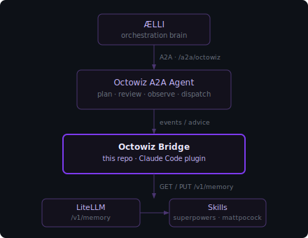

<div align="center">


# octowiz

**Octowiz Bridge** — the Claude Code adapter for the Octowiz Engineering Agent.

[](LICENSE)


[**Live overview ↗**](https://raelli.github.io/octowiz/) &nbsp;·&nbsp; [ÆLLI — orchestration brain](https://github.com/raelli/aelli) &nbsp;·&nbsp; [Install](#setup) &nbsp;·&nbsp; [Diagnostics](#diagnostics)

[Architecture](#architecture) &nbsp;·&nbsp; [Setup](#setup) &nbsp;·&nbsp; [Using /octowiz](#using-octowiz) &nbsp;·&nbsp; [Reference](#reference)

</div>

---

## Why this exists

Most AI coding tools give agents either a giant system prompt or nothing. Octowiz takes a third path: doctrine lives in a memory store, agents fetch only what is relevant to their current phase, and the coordinator skill routes to purpose-built skill libraries rather than trying to be everything itself.

> **Small context. No prompt soup.**

---

## Architecture



### Components

| Name | What it is |
|---|---|
| **ÆLLI** | The orchestration brain. Delegates coding work to Octowiz via A2A. Makes strategic decisions Octowiz escalates up. |
| **Octowiz Agent** | The A2A server (`/a2a/octowiz`). Handles reasoning, advisor rules, diary writing, and escalation to ÆLLI. Built separately — not in this repo. |
| **Octowiz Bridge** | This repo. The Claude Code plugin. Hooks into developer sessions, routes to skills, seeds project memory. Install name: `octowiz`. |
| **Octowiz Advisor** | Capability inside the Agent. Detects spec drift, file conflicts, and branch deviations. |
| **LiteLLM** | Platform layer. Hosts the A2A Gateway, Memory API, and IntegraHub Marketplace. |

### Memory namespaces

| Prefix | Count | What it contains |
|---|:--:|---|
| `playbook:*` | **17** | Workflow doctrine: how to plan, slice, implement, review, and ship. Covers context management, alignment interviews, PRD structure, tracer-bullet slicing, HITL vs AFK, TDD, fresh-context review, deep modules, frontend prototypes, parallel agents, and more. |
| `skills:*` | **3** | Routing summaries for the two upstream skill libraries (mattpocock/skills, obra/superpowers) and the marketplace skills hub. |
| `agent:{role}:*` | **4** | Role-specific memory slices for `planner`, `implementer`, `reviewer`, and `qa`. Each agent pulls only its own slice. |
| `config:*` | **2** | Import guidance and the retrieval contract the coordinator reads on startup. |

Memory keys follow the pattern:

```text
team:allspark:playbook:ai-coding-workflow:*   shared doctrine
team:allspark:skills:*                        external skill routing
agent:{role}:memory:ai-coding-workflow        role-specific
project:allspark:config:*                     import / namespacing
```

`allspark` is the example namespace. Swap it for your own when forking — nobody wants to debug under someone else's project name.
