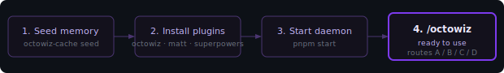

<div align="center">


# octowiz

**Octowiz Bridge** — the Claude Code adapter for the Octowiz Engineering Agent.

[](LICENSE)


[**Live overview ↗**](https://raelli.github.io/octowiz/) &nbsp;·&nbsp; [ÆLLI — orchestration brain](https://github.com/raelli/aelli) &nbsp;·&nbsp; [Install](#setup) &nbsp;·&nbsp; [Diagnostics](#diagnostics)

[Architecture](#architecture) &nbsp;·&nbsp; [Setup](#setup) &nbsp;·&nbsp; [Using /octowiz](#using-octowiz) &nbsp;·&nbsp; [Reference](#reference)

</div>

---

## Why this exists

Most AI coding tools give agents either a giant system prompt or nothing. Octowiz takes a third path: doctrine lives in a memory store, agents fetch only what is relevant to their current phase, and the coordinator skill routes to purpose-built skill libraries rather than trying to be everything itself.

> **Small context. No prompt soup.**

---

## Architecture


### Components

| Name | What it is |
|---|---|
| **ÆLLI** | The orchestration brain. Delegates coding work to Octowiz via A2A. Makes strategic decisions Octowiz escalates up. |
| **Octowiz Agent** | The A2A server (`/a2a/octowiz`). Handles reasoning, advisor rules, diary writing, and escalation to ÆLLI. Built separately — not in this repo. |
| **Octowiz Bridge** | This repo. The Claude Code plugin. Hooks into developer sessions, routes to skills, seeds project memory. Install name: `octowiz`. |
| **Octowiz Advisor** | Capability inside the Agent. Detects spec drift, file conflicts, and branch deviations. |
| **LiteLLM** | Platform layer. Hosts the A2A Gateway, Memory API, and IntegraHub Marketplace. |

### Memory namespaces

| Prefix | Count | What it contains |
|---|:--:|---|
| `playbook:*` | **17** | Workflow doctrine: how to plan, slice, implement, review, and ship. Covers context management, alignment interviews, PRD structure, tracer-bullet slicing, HITL vs AFK, TDD, fresh-context review, deep modules, frontend prototypes, parallel agents, and more. |
| `skills:*` | **3** | Routing summaries for the two upstream skill libraries (mattpocock/skills, obra/superpowers) and the marketplace skills hub. |
| `agent:{role}:*` | **4** | Role-specific memory slices for `planner`, `implementer`, `reviewer`, and `qa`. Each agent pulls only its own slice. |
| `config:*` | **2** | Import guidance and the retrieval contract the coordinator reads on startup. |

Memory keys follow the pattern:

```text
team:allspark:playbook:ai-coding-workflow:*   shared doctrine
team:allspark:skills:*                        external skill routing
agent:{role}:memory:ai-coding-workflow        role-specific
project:allspark:config:*                     import / namespacing
```

`allspark` is the example namespace. Swap it for your own when forking — nobody wants to debug under someone else's project name.

---

## Setup



Four steps to a working `/octowiz`.

### 1. Seed memory into LiteLLM

The workflow doctrine lives in LiteLLM's `/v1/memory` store. Use `octowiz-cache seed` to populate it for your project.

Set your LiteLLM endpoint and key:

```bash
export LITELLM_BASE_URL="https://your-proxy.example.com"
export LITELLM_ADMIN_API_KEY="sk-..."
```

Seed the project namespace (idempotent — safe to rerun):

```bash
octowiz-cache seed
```

Or seed with an explicit project slug:

```bash
octowiz-cache seed --project my-project
```

Confirm the seed landed:

```bash
curl "$LITELLM_BASE_URL/v1/memory/team%3Aallspark%3Askills%3Amatt-pocock%3Aai-engineering" \
  -H "Authorization: Bearer $LITELLM_ADMIN_API_KEY"
```

Or fetch a whole prefix:

```bash
curl "$LITELLM_BASE_URL/v1/memory?key_prefix=team:allspark:playbook:ai-coding-workflow:" \
  -H "Authorization: Bearer $LITELLM_ADMIN_API_KEY"
```

Team-scoped writes under `team:allspark:*` require proxy-admin scope. The commands above read `LITELLM_ADMIN_API_KEY` first and fall back to `LITELLM_API_KEY`.

### 2. Install the Claude Code plugins

Add the IntegraHub marketplace to `~/.claude/settings.json`:

```json
{
  "extraKnownMarketplaces": {
    "integrahub": {
      "source": "url",
      "url": "https://llm.integrahub.de/claude-code/marketplace.json"
    }
  },
  "env": {
    "LITELLM_BASE_URL": "https://your-proxy.example.com",
    "LITELLM_API_KEY": "sk-..."
  }
}
```

Then open Claude Code and run `/plugins` to install the three required plugins:

| Plugin | Provides |
|---|---|
| `octowiz` | The `/octowiz` coordinator skill (this repo) |
| `mattpocock-skills` | Alignment, PRD, TDD, diagnosis, architecture, handoff skills |
| `superpowers` | Brainstorming, plans, worktrees, subagents, review, verification skills |

All three are required. `/octowiz` routes to skills from the other two — if either is missing the coordinator will fail mid-flow.

### 3. Start the daemon

The Octowiz daemon is a Node.js service that runs per machine. It connects the Claude Code hooks to the AELLI A2A network and handles capability dispatch.

```bash
pnpm start
```

Or directly:

```bash
node index.js
```

The Claude Code hooks (SessionStart, PostToolUse, UserPromptSubmit, Stop) fire automatically once the plugin is installed. They do not manage the daemon lifecycle.

#### Env vars

| Var | Purpose |
|---|---|
| `AELLI_BASE_URL` | AELLI server base URL |
| `OCTOWIZ_A2A_URL` | Direct A2A server URL override |
| `OCTOWIZ_A2A_PORT` | A2A server port (default: 8765) |
| `OCTOWIZ_DISPATCH_TIMEOUT` | Seconds before capability dispatch times out |
| `OCTOWIZ_INBOUND_SECRET` | Shared secret for inbound hook verification |

For memory and doctrine configuration, set these in `~/.claude/settings.json` under `env`:

| Var | Default | Purpose |
|---|---|---|
| `LITELLM_BASE_URL` | — | LiteLLM proxy URL for memory retrieval |
| `LITELLM_API_KEY` | — | API key for memory reads |
| `OCTOWIZ_NAMESPACE` | `allspark` | Memory namespace |
| `OCTOWIZ_CACHE_DIR` | `~/.cache/octowiz` | Doctrine cache root |
| `OCTOWIZ_CACHE_TTL_SECONDS` | `3600` | Bundle revalidation interval |
| `OCTOWIZ_CACHE_BYPASS` | — | Set to `1` to skip cache entirely |

### 4. Run /octowiz

Open any repo in Claude Code and invoke the coordinator:

```text
/octowiz
```

The coordinator reads your project setup, fetches the relevant doctrine from LiteLLM, and routes you to the right workflow.

Run `/mattpocock-skills:setup-matt-pocock-skills` once per repo before first use to wire your issue tracker and domain docs.
